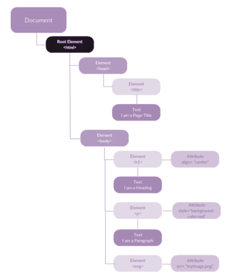

Como vimos a lo largo del prework y hemos visto al inicio de este bloque, HTML sigue una estructura en árbol con sus nodos

El DOM es la estructura de objetos que genera el navegador con todos sus elementos, lo que nos va a permitir trabajar sobre él y manipularlo.

Los nodos más importantes que debemos conocer:

- **DOCUMENT:** Es el nodo raíz de todo documento HTML
- **ELEMENT**: Es el contenido que se define por las etiquetas/tags de HTML. Estas a su vez pueden tener más hijos element y también atributos
- **ATTR**: Representa los atributos de ese elemento
- **TEXT**: El contenido del texto que se encuentra en una etiqueta HTML




## **BÚSQUEDA EN EL DOM**

A través de un API de Javascript podemos acceder y manipular los nodos del DOM. 

Vamos a ver primero como poder recorrer el DOM, para ello, utilizaremos una serie de funciones que nos van a permitir hacerlo:


### **querySelector(selector)**

Devuelve el primer elemento del documento que coincida con las especificaciones de selectores.

Por ejemplo, teniendo el siguiente HTML:


```html
<body>
    <h1 id="tituloPrincipal"> Este es un titulo </h1>
		<h1 class="titulos-importantes"> Este es un titulo </h1>
</body>
```


Según el argumento o parámetro que introduzcamos en la función, seleccionará un h1 u otro


```jsx
/*
	Introduciendo una etiqueta, seleccionará la primera que se encuentre, en este
	caso el primer h1.
*/
let element = document.querySelector('h1'); 

/*
	Introduciendo una clase, seleccionará la primera que se encuentre con ese 
	nombre, en este caso el segundo h1.
*/
let element = document.querySelector('.titulos-importantes'); 

/*
	Introduciendo un ID, seleccionará la primera que se encuentre con ese 
	nombre, en este caso el primer h1.
*/
let element = document.querySelector('#tituloPrincipal'); 

```


### **querySelectorAll(selector)**

Devuelve un array con todos los elementos que correspondan con el id, clase, etiqueta… introducidos. Es igual que el querySelector pero en vez de devolver el primer elemento que coincida devuelve un array con todos los que coincidan.


```jsx
let element = document.querySelectorAll('h1'); 
```


### **getElementById(id)**

Devuelve el primer elemento con el ID específico. Recordad que los IDs son únicos por lo tanto solo devolverá un elemento.


```jsx
let element = document.getElementById('tituloPrincipal'); 
```


### **getElementsByClassName(className)**

Devuelve un array con todos los elementos que tengan esa className.


```jsx
let element = document.getsElementsByClassName('titulos-importantes'); 
```


### **getElementsByTagName(tagName)**

Devuelve un array con todos los elementos que tengan un tag específico.


```jsx
let element = document.getElementById('tituloPrincipal');
```
 

### getAttribute**()**


```jsx
let element = document.getElementById('link');
let attribute = element.getAttribute('href');
```

  
### childNodes / parentNodes

Podemos acceder tanto a elementos padre como a hijos a través de las siguientes referencias


```jsx
// Obtener los hijos de un elemento
let element = document.getElementById('id1');
let childNodes = element.childNodes;

// Su nodo padre
let parentNode = element.parentNode;
```