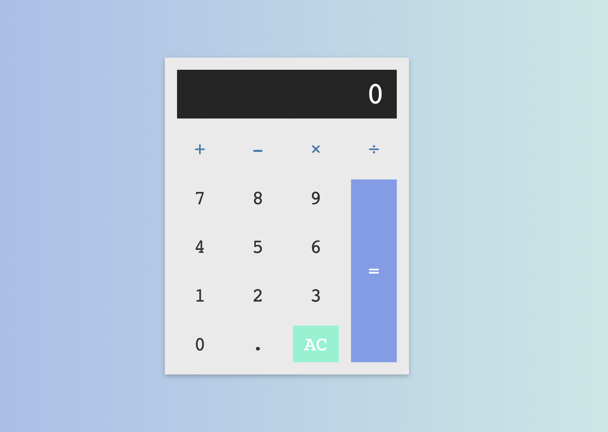

> [Recursos](recursos/calculadora_base.zip)

¡Llega el momento de practicar y hacer cuentas!

Para este ejercicio os proporcionamos el HMTL y SCSS. Tocando únicamente en el fichero main.js tendréis que dar funcionalidad básica a la calculadora.

Para simplificar, asumir que no tenemos números negativos en nuestras operaciones, esto os va a simplificar mucho la validación de los operadores.

PD: Si tenéis ganas, es muy interesante probar a montar la estructura y estilos por vosotros mismos.